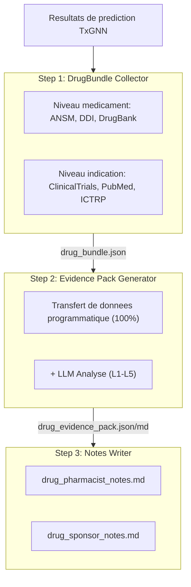
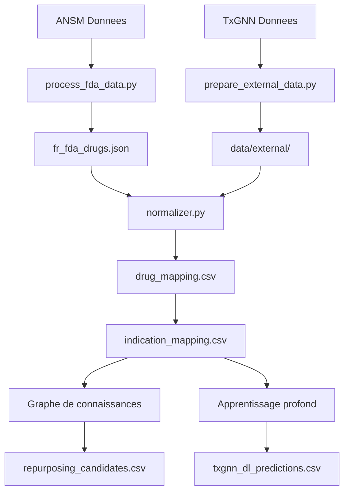

# FRTxGNN - France: Repositionnement de Medicaments

[](https://frtxgnn.yao.care)
[](https://opensource.org/licenses/MIT)

Predictions de repositionnement de medicaments pour les medicaments approuves par ANSM (France) utilisant le modele TxGNN.

## Avertissement

- Les resultats de ce projet sont uniquement a des fins de recherche et ne constituent pas un avis medical.
- Les candidats au repositionnement de medicaments necessitent une validation clinique avant application.

## Apercu du projet

### Statistiques des rapports

| Element | Nombre |
|------|------|
| **Rapports de medicaments** | 315 |
| **Predictions totales** | 7,046,174 |
| **Medicaments uniques** | 455 |
| **Indications uniques** | 17,041 |
| **Donnees DDI** | 302,516 |
| **Donnees DFI** | 857 |
| **Donnees DHI** | 35 |
| **Donnees DDSI** | 8,359 |
| **Ressources FHIR** | 315 MK / 1,928 CUD |

### Distribution des niveaux de preuve

| Niveau de preuve | Nombre de rapports | Description |
|---------|-------|------|
| **L1** | 0 | Plusieurs ECR de Phase 3 |
| **L2** | 0 | ECR unique ou plusieurs Phase 2 |
| **L3** | 0 | Etudes observationnelles |
| **L4** | 0 | Etudes precliniques / mecanistiques |
| **L5** | 315 | Prediction computationnelle uniquement |

### Par source

| Source | Predictions |
|------|------|
| DL | 7,044,246 |
| KG + DL | 1,698 |
| KG | 230 |

### Par confiance

| Confiance | Predictions |
|------|------|
| very_high | 1,307 |
| high | 397,364 |
| medium | 858,626 |
| low | 5,788,877 |

---

## Methodes de prediction

| Methode | Vitesse | Precision | Exigences |
|------|------|--------|----------|
| Graphe de connaissances | Rapide (secondes) | Inferieure | Aucune exigence particuliere |
| Apprentissage profond | Lent (heures) | Superieure | Conda + PyTorch + DGL |

### Methode du graphe de connaissances

```bash
uv run python scripts/run_kg_prediction.py
```

| Metrique | Valeur |
|------|------|
| ANSM Total des medicaments | 20,856 |
| Mappes a DrugBank | 4,011 (19.2%) |
| Candidats au repositionnement | 1,928 |

### Methode d'apprentissage profond

```bash
conda activate txgnn
PYTHONPATH=src python -m frtxgnn.predict.txgnn_model
```

| Metrique | Valeur |
|------|------|
| Predictions DL totales | 964,428 |
| Medicaments uniques | 455 |
| Indications uniques | 17,041 |

### Interpretation des scores

Le score TxGNN represente la confiance du modele dans une paire medicament-maladie, allant de 0 a 1.

| Seuil | Signification |
|-----|------|
| >= 0.9 | Confiance tres elevee |
| >= 0.7 | Confiance elevee |
| >= 0.5 | Confiance moderee |

#### Distribution des scores

| Seuil | Signification |
|-----|------|
| ≥ 0.9999 | Confiance extremement elevee, predictions les plus confiantes du modele |
| ≥ 0.99 | Confiance tres elevee, a prioriser pour la validation |
| ≥ 0.9 | Confiance elevee |
| ≥ 0.5 | Confiance moderee (frontiere de decision sigmoide) |

#### Definitions des niveaux de preuve

| Niveau | Definition | Signification clinique |
|-----|------|---------|
| L1 | ECR de phase 3 ou revue systematique | Peut soutenir l'utilisation clinique |
| L2 | ECR de phase 2 | Peut etre envisage pour utilisation |
| L3 | Phase 1 ou etude observationnelle | Necessite une evaluation supplementaire |
| L4 | Rapport de cas ou recherche preclinique | Pas encore recommande |
| L5 | Prediction informatique uniquement, aucune preuve clinique | Necessite des recherches supplementaires |

#### Rappels importants

1. **Des scores eleves ne garantissent pas l'efficacite clinique : les scores TxGNN sont des predictions basees sur des graphes de connaissances necessitant une validation par essais cliniques.**
2. **Des scores faibles ne signifient pas inefficace : le modele n'a peut-etre pas appris certaines associations.**
3. **Recommande d'utiliser avec le pipeline de validation : utilisez les outils de ce projet pour examiner les essais cliniques, la litterature et d'autres preuves.**

### Pipeline de validation



---

## Demarrage rapide

### Etape 1: Telecharger les donnees

| Fichier | Telechargement |
|------|------|
| ANSM Donnees | [Base de données publique des médicaments (BDPM)](https://base-donnees-publique.medicaments.gouv.fr/index.php/download/file/) |
| node.csv | [Harvard Dataverse](https://dataverse.harvard.edu/api/access/datafile/7144482) |
| kg.csv | [Harvard Dataverse](https://dataverse.harvard.edu/api/access/datafile/7144484) |
| edges.csv | [Harvard Dataverse](https://dataverse.harvard.edu/api/access/datafile/7144483) |
| model_ckpt.zip | [Google Drive](https://drive.google.com/uc?id=1fxTFkjo2jvmz9k6vesDbCeucQjGRojLj) |

### Etape 2: Installer les dependances

```bash
uv sync
```

### Etape 3: Traiter les donnees medicamenteuses

```bash
uv run python scripts/process_fda_data.py
```

### Etape 4: Preparer les donnees de vocabulaire

```bash
uv run python scripts/prepare_external_data.py
```

### Etape 5: Executer la prediction par graphe de connaissances

```bash
uv run python scripts/run_kg_prediction.py
```

### Etape 6: Configurer l'environnement d'apprentissage profond

```bash
conda create -n txgnn python=3.11 -y
conda activate txgnn
pip install torch==2.2.2 torchvision==0.17.2
pip install dgl==1.1.3
pip install git+https://github.com/mims-harvard/TxGNN.git
pip install pandas tqdm pyyaml pydantic ogb
```

### Etape 7: Executer la prediction par apprentissage profond

```bash
conda activate txgnn
PYTHONPATH=src python -m frtxgnn.predict.txgnn_model
```

---

## Ressources

### TxGNN Noyau

- [TxGNN Paper](https://www.nature.com/articles/s41591-024-03233-x) - Nature Medicine, 2024
- [TxGNN GitHub](https://github.com/mims-harvard/TxGNN)
- [TxGNN Explorer](http://txgnn.org)

### Sources de donnees

| Categorie | Donnees | Source | Note |
|------|------|------|------|
| **Donnees medicamenteuses** | ANSM | [Base de données publique des médicaments (BDPM)](https://base-donnees-publique.medicaments.gouv.fr/index.php/download/file/) | France |
| **Graphe de connaissances** | TxGNN KG | [Harvard Dataverse](https://dataverse.harvard.edu/dataset.xhtml?persistentId=doi:10.7910/DVN/IXA7BM) | 17,080 diseases, 7,957 drugs |
| **Base de donnees de medicaments** | DrugBank | [DrugBank](https://go.drugbank.com/) | Mappage d'ingredients medicamenteux |
| **Interactions medicamenteuses** | DDInter 2.0 | [DDInter](https://ddinter2.scbdd.com/) | Paires DDI |
| **Interactions medicamenteuses** | Guide to PHARMACOLOGY | [IUPHAR/BPS](https://www.guidetopharmacology.org/) | Interactions medicamenteuses approuvees |
| **Essais cliniques** | ClinicalTrials.gov | [CT.gov API v2](https://clinicaltrials.gov/data-api/api) | Registre d'essais cliniques |
| **Essais cliniques** | WHO ICTRP | [ICTRP API](https://apps.who.int/trialsearch/api/v1/search) | Plateforme internationale d'essais cliniques |
| **Litterature** | PubMed | [NCBI E-utilities](https://eutils.ncbi.nlm.nih.gov/entrez/eutils/) | Recherche de litterature medicale |
| **Mappage de noms** | RxNorm | [RxNav API](https://rxnav.nlm.nih.gov/REST) | Standardisation des noms de medicaments |
| **Mappage de noms** | PubChem | [PUG-REST API](https://pubchem.ncbi.nlm.nih.gov/docs/pug-rest) | Recherche de synonymes chimiques |
| **Mappage de noms** | ChEMBL | [ChEMBL API](https://www.ebi.ac.uk/chembl/api/data) | Base de donnees de bioactivite |
| **Normes** | FHIR R4 | [HL7 FHIR](http://hl7.org/fhir/) | MedicationKnowledge, ClinicalUseDefinition |
| **Normes** | SMART on FHIR | [SMART Health IT](https://smarthealthit.org/) | Integration EHR, OAuth 2.0 + PKCE |

### Telechargements de modeles

| Fichier | Telechargement | Note |
|------|------|------|
| Modele pre-entraine | [Google Drive](https://drive.google.com/uc?id=1fxTFkjo2jvmz9k6vesDbCeucQjGRojLj) | model_ckpt.zip |
| node.csv | [Harvard Dataverse](https://dataverse.harvard.edu/api/access/datafile/7144482) | Donnees de noeuds |
| kg.csv | [Harvard Dataverse](https://dataverse.harvard.edu/api/access/datafile/7144484) | Donnees du graphe de connaissances |
| edges.csv | [Harvard Dataverse](https://dataverse.harvard.edu/api/access/datafile/7144483) | Donnees d'aretes (DL) |

## Presentation du projet

### Structure des repertoires

```
FRTxGNN/
├── README.md
├── CLAUDE.md
├── pyproject.toml
│
├── config/
│   └── fields.yaml
│
├── data/
│   ├── kg.csv
│   ├── node.csv
│   ├── edges.csv
│   ├── raw/
│   ├── external/
│   ├── processed/
│   │   ├── drug_mapping.csv
│   │   ├── repurposing_candidates.csv
│   │   ├── txgnn_dl_predictions.csv.gz
│   │   └── integration_stats.json
│   ├── bundles/
│   └── collected/
│
├── src/frtxgnn/
│   ├── data/
│   │   └── loader.py
│   ├── mapping/
│   │   ├── normalizer.py
│   │   ├── drugbank_mapper.py
│   │   └── disease_mapper.py
│   ├── predict/
│   │   ├── repurposing.py
│   │   └── txgnn_model.py
│   ├── collectors/
│   └── paths.py
│
├── scripts/
│   ├── process_fda_data.py
│   ├── prepare_external_data.py
│   ├── run_kg_prediction.py
│   └── integrate_predictions.py
│
├── docs/
│   ├── _drugs/
│   ├── fhir/
│   │   ├── MedicationKnowledge/
│   │   └── ClinicalUseDefinition/
│   └── smart/
│
├── model_ckpt/
└── tests/
```

**Legende**: 🔵 Developpement du projet | 🟢 Donnees locales | 🟡 Donnees TxGNN | 🟠 Pipeline de validation

### Flux de donnees



---

## Citation

Si vous utilisez ce jeu de donnees ou ce logiciel, veuillez citer :

```bibtex
@software{frtxgnn2026,
  author       = {Yao.Care},
  title        = {FRTxGNN: Drug Repurposing Validation Reports for France ANSM Drugs},
  year         = 2026,
  publisher    = {GitHub},
  url          = {https://github.com/yao-care/FRTxGNN}
}
```

Citez egalement l'article original TxGNN :

```bibtex
@article{huang2023txgnn,
  title={A foundation model for clinician-centered drug repurposing},
  author={Huang, Kexin and Chandak, Payal and Wang, Qianwen and Haber, Shreyas and Zitnik, Marinka},
  journal={Nature Medicine},
  year={2023},
  doi={10.1038/s41591-023-02233-x}
}
```
